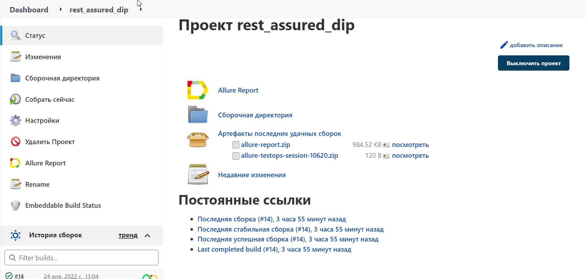
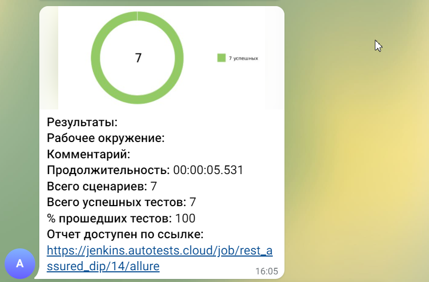

## Api automation testing for https://reqres.in/

#### *Quick project example with infrastructure: Api tests with Allure report, and push notifications to Telegram*

### Technology Stack

### Allure report

### Allure TestOps  
Dashboards

Test cases

### Jenkins
https://jenkins.autotests.cloud/job/rest_assured_dip/

### Telegram

